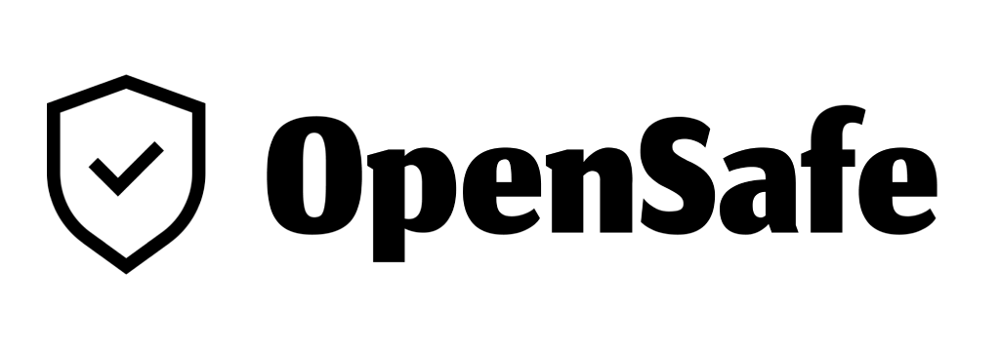

OpenSafe is a chrome extension that notifies users if they're visiting a malicious URL that might qualify as a phishing scam. For example, the following URLs:
1. https://maybank2u.com
2. https://mаybаnk2u.com

They look the same but they're using the [cyrillic letter 'a'](https://en.wikipedia.org/wiki/A_(Cyrillic)) which is misleading and can point to different websites.